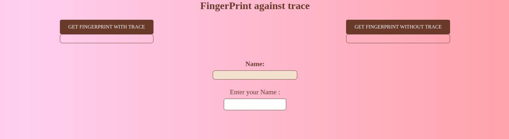
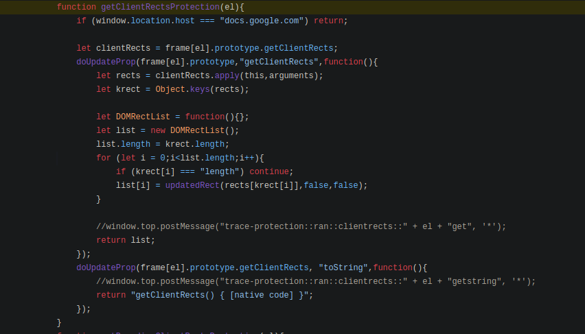
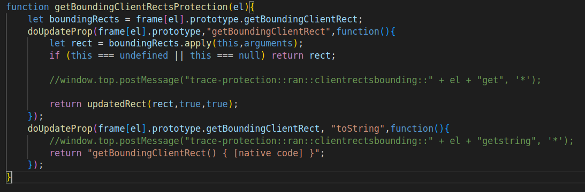

:::note
The goal of this project was to bypass an extension who was create to block fingerprinting.
:::

## Privacy project

# Bypassing Trace extension

---
abstract: |
  We will present our research on the Trace extension and the method we
  have developed to obtain a single fingerprint for a user who has this
  extension installed. To introduce our work, we will begin by
  explaining our subject and the prerequisites, and then delve deeper
  into our findings. We have chosen the topic of fingerprinting in
  relation to Trace, with a specific focus on the getClientRect
  protection in Trace. Later, we will explain why we selected this
  attack. Because of our subject, we decided to enter our report in the
  form of a Latex with our code attached.
author:
- |
  MatiBP - JH\
  M1 Cybersécurité\
date: 2024
title: Trace
---

------------------------------------------------------------------------

------------------------------------------------------------------------

Introduction
============

The Trace Extension
-------------------

Let's explain what Trace is. Trace is a browser extension designed to
enhance your online privacy and security. Developed by a single person
and open-source, Trace aims to protect users from the proliferation of
digital tracking mechanisms across the internet that can lead to privacy
vulnerabilities and exploitation of personal data. Trace acts as a
digital shield, offering advanced fingerprinting protection.

What is Fingerprinting ?
------------------------

Fingerprinting is a technique employed by websites and third-party
trackers to identify and track individual users across the internet. The
spectrum of fingerprinting is more extensive than initially thought.
Unlike traditional cookies, which can be readily blocked or deleted,
fingerprinting can relies on gathering unique information about your
device and browser configuration. This information includes, but is not
limited to, screen resolution, installed fonts, and plugins.

The collected information is subsequently used to generate a unique
digital identifier, or fingerprint, for each user. This fingerprint
enables tracking across various websites, without user consent. Such a
method is more invasive and covert than conventional tracking
techniques, raising substantial concerns among privacy advocates.

How Does Trace Work?
--------------------

Trace employs algorithms and techniques to disrupt fingerprinting
attempts effectively. By analyzing and obfuscating the information
typically used for fingerprinting, Trace makes it significantly harder
for trackers to identify and follow your online activities. It
dynamically alters your browser's configuration to generate randomized
fingerprint attributes. For example, Trace can introduces deliberate
noise into your fingerprint and substitutes certain function calls.

Our approach
============

To begin, we had to choose a FingerPrint attack among the fingerprint
protections offered by Trace. To do this, we started by studying the
Trace extension.

Trace is an older browser extension that hasn't received updates for
quite some time. As a result, it may not be effective against the
majority of fingerprinting attacks observed in our tests. Our
observations indicate that it may not effectively counter many of the
fingerprinting techniques employed by websites today. To verify this, we
visited sites that offered to test different fingerprinting attacks, and
despite our Trace extension, the sites were able to retrieve our
fingerprint.

You can download Trace and then test your fingerprinting on these
websites:\
[First site to test - browserleaks](https://browserleaks.com/)\
[Second site to test - bromite](https://www.bromite.org/detect)\
However, on these sites, we observed that the fingerprint attack with
getClientRects is still patched by Trace. So we selected this attack,
who use the getClientRects method, to try to bypass the Trace
protection.

What is getClientRects ?
========================

The Document Object Model (DOM) is a hierarchical representation of
elements within a web page. Each element on the page (such as a
paragraph, an image, a link) is represented by a node in the DOM tree.
These nodes can be manipulated via scripts to change the content, style,
and behavior of the web page.\
Now, regarding getClientRects():\
The getClientRects() method is a method of the Element interface in the
DOM. It allows you to retrieve a list of bounding rectangles for the
specified element. A bounding rectangle is a rectangle that surrounds an
element on the web page. This method returns a list of all bounding
rectangles that enclose the element, taking into account CSS
transformations such as translation, scaling, rotation, etc.

When you call getClientRects() on a DOM element, you receive a list of
rectangles that describe the position and size of that element within
the browser window. This is particularly useful for determining the
precise layout of an element on a page. Additionally, it's important to
note that the returned rectangles are relative to the viewport.

First attack
============

To carry out our first naive attack, we set up a server locally that
allows us to launch our attack to retrieve a fingerprint using the
getClientRects() method to extract fingerprint data from users'
browsers.

For this first attack, Trace is effective, he introduces deliberate
noise into your fingerprint and substitutes certain function calls. But
without Trace the fingerprint can be stored in a database and has
effectively allowed us to recognize different users of our site based on
their unique fingerprint.\

{width="0.85\\linewidth"}

To carry out our attack, we relied on websites that provide clear
explanations and practical examples of similar attacks. This allowed us
to understand the methodologies and tools involved.\
[First site :
fp\_getclientrects](https://privacycheck.sec.lrz.de/active/fp_gcr/fp_getclientrects.html)\
[Second site :
advanced-tor-browser-fingerprinting](https://web.archive.org/web/20240314091307/http://jcarlosnorte.com/security/2016/03/06/advanced-tor-browser-fingerprinting.html)\
With this informations we create our own first attack :\
The attack on finprinting with getClientRects exploits the fact that
this DOM method provides detailed information about the CSS border
rectangles of elements on a web page, including their exact dimensions
and positions.

![[\[fig:privacyProject1\]]{#fig:privacyProject1
label="fig:privacyProject1"} First attack with
getClientRects](images/privacyProject1.png){#fig:privacyProject1
width="0.75\\linewidth"}

The attack exploiting the getClientRects method to retrieve bounding
rectangle information of specific HTML elements with the CSS class
\"fingerprint-element\". The function iterates through all matching
elements and extracts the coordinates and dimensions of their first
bounding rectangle. These values are then added to a data array. The
collected information is used to generate a unique fingerprint of the
user by combining hashed values of multiple DOMRect objects. The
\"fingerprint\" array is converted into JSON format and hashed using the
SHA-256 hashing algorithm from CryptoJS to generate a unique
fingerprint. We can notice that the retrieved values can vary across
browsers, making the fingerprint even more distinctive.\
As mentioned earlier, our implementation allows us to get individual
fingerprint of differents user/devices of our site. However, it is still
patched if Trace is activate.\

![[\[fig:privacyProject1\]]{#fig:privacyProject1
label="fig:privacyProject1"}First
fingerprint](images/fingerprint1.png){#fig:privacyProject1
width="0.85\\linewidth"}

As you can see, the attack on the right generates a changing
fingerprint, while on the left, we obtain a consistent fingerprint
despite attempts to block tracing. We will soon explain how.

![[\[fig:privacyProject1\]]{#fig:privacyProject1
label="fig:privacyProject1"}Second
fingerprint](images/fingerprint2.png){#fig:privacyProject1
width="0.85\\linewidth"}

To begin, we need to understand how Trace Patch this attack and how to
bypass it. It should be emphasized that countermeasures for our method
are limited because this functionality is widely supported by browsers
and cannot be easily disabled.

How Trace patch us
==================

We discovered that Trace dynamically manipulates elements on the page,
subtly altering their position and dimensions. This manipulation
disrupts the accuracy of measurements obtained through getClientRects.

Moreover, Trace introduces randomness into the client rectangles
returned by getClientRects. Instead of offering precise and consistent
measurements, it generates randomized values, thereby obscuring the
information gathered by trackers.

To gain a deeper understanding of this mechanism, we examined Trace's
GitHub repository to explore its implementation, with the aim of
potentially circumventing it.

[Github -
Trace](https://github.com/underrobyn/AbsoluteDoubleTrace/blob/master/MyTrace/js/contentscript/page.js#L532)

To be more specific, there is a specific function within Trace that was
responsible for blocking our method.

{width="0.75\\linewidth"}

This function, getClientRectsProtection, aims to counter fingerprinting
attempts using the getClientRects method. It begins by checking if the
current website's host is \"docs.google.com\". If so, it immediately
halts its execution, indicating that no protection is needed on Google
Docs.

Then, it intercepts calls to the getClientRects method, storing a
reference to the original method and replacing it with a custom
function. This function modifies the behavior of getClientRects by
calculating new bounding rectangles for the element and returning a
modified DOMRectList object containing these updated rectangles. It
utilizes her function updatedRect, which generates updated bounding
rectangles based on the original bounding rectangle with added noise
(Math.random).

How bypass to bypass this protection
====================================

So with that, we've considered different solutions, such as blocking the
Trace script, pretending to be \[docs.google.com\], ensuring that Trace
doesn't detect our use of getClientRects, try to break this function by
overwrite some of her use, or trying to use another DOM method, like
getBoundingClientRect. We try all this solutions.

First idea : use another methode
--------------------------------

Therefore, we began by testing the idea of using another DOM function
that would retrieve a fingerprint in a similar fashion to
getClientRects, and we thought of the getBoundingClientRect method.

### What is getBoundingClientRect ?

The getBoundingClientRect() method is also a method of the Element
interface in the DOM. Unlike getClientRects(), which returns a list of
all bounding rectangles encompassing the element,
getBoundingClientRect() returns a single object of type DOMRect. This
object represents a rectangle containing the dimensions and position of
the element relative to the browser's viewport.

The rectangle returned by getBoundingClientRect() is defined by the
coordinates of its top-left corner (left and top) relative to the
top-left corner of the browser's viewport, along with its width (width)
and height (height). Additionally, it also provides the coordinates of
the bottom-right corner (right and bottom) of the rectangle.

In summary, getBoundingClientRect() provides an accurate description of
the position and size of an element relative to the browser's viewport.

### getBoundingClientRect protection

There's also protection on this function, the
getBoundingClientRectsProtection function, whichact similarly to the
otherone.

{width="0.75\\linewidth"}

Similarly to the protection on getClientRects, the function
getBoundingClientRectsProtection aims to protect access to the
getBoundingClientRect method of specified elements of a page.

Initially, it records the original getBoundingClientRect method for the
specified element, then replaces it with a function that performs
additional checks before returning the bounding rectangle. These checks
include validating the presence of the element and securing the result
returned by the original method through updatedRect(). Additionally, it
replaces the toString method of the object returned by
getBoundingClientRect, likely to conceal the modification made to the
method.\
So, after understanding this, we developed a new attack to obtain the
fingerprint. To use getBoundingClientRect we use an alternative
function, getRectsFingerprintWithoutBlocking(), who call the methode and
we discoverer that the protection wouldn't work on the attack because it
bypasses the call to getBoundingClientRectProtection by using an
alternative function which directly returns the result of
element.getBoundingClientRect(). Since the protection doesn't modify
this alternative function, it has no effect on its behavior. Therefore,
this function could still access the bounding rectangles without being
affected by the protection.

{width="0.83\\linewidth"}

With this second attack, we are capable of retrieving a fingerprint
across different devices and browsers and being able to identify them
despite their use of Trace, as seen in the fingerprint on the left in
figures 3 and 4. However, let's try to find other ways to bypass Trace.

Second idea: hide the use of getClientRects
-------------------------------------------

For this second idea, we attempted to bypass the protection of
getClientRects in the same way as for getBoundingClientRects, by hiding
our method call. However, this approach worked, for the same reason as
before, and we were able to recover the fingerprints despite the
activation of Trace

{width="0.83\\linewidth"}

Third idea: block Trace
-----------------------

So we tried a third, more radical method. On our page, we examined how
Trace was being invoked and identified two scripts that were placed
between the \<html\> and \<head\> tags. We then attempted to remove or
disable them.\
To do this, we experimented with several techniques. Initially, we
attempted to disable all scripts on the page except our own using a
\<meta\> tag to define a Content Security Policy. This policy allowed
the execution of scripts from the same domain ('self'), inline scripts
('unsafe-inline'), as well as scripts with the data-mark attribute set
to 'my' and those sourced from cdnjs.cloudflare.com. Other script
sources were blocked.

``` {.html breaklines="true"}
<meta http-equiv="Content-Security-Policy" content="script-src 'self' 'unsafe-inline' '[data-mark=my]' http://cdnjs.cloudflare.com">
```

This technique didn't work, as if the scripts were being called before
we could block them, or rather, as if blocking them didn't work.\
So, we tried instead to remove them from the page altogether. For this,
we created a function that removes the scripts that are not ours.

``` {.javascript breaklines="true"}
document.addEventListener('DOMContentLoaded', function () {
    var scripts = document.querySelectorAll('script');
    scripts.forEach(function (script) {
      if (!script.hasAttribute('data-mark') || script.getAttribute('data-mark') !== 'my') {
        script.replaceWith("tooLate"); // Supprime le script s'il n'a pas l'attribut data-mark="my"
      }
    });
  });
```

This code successfully eliminated the two scripts, but despite this, our
attack still didn't work. We managed to remove the scripts added between
our two tags on our page, but upon inspecting the debugger in our
browser, the protection functions were still being invoked through the
extension.

For example, on Mozilla, the script was no longer on the page, but the
extension was still being called.\

``` {.text breaklines="true"}
moz-extension://e4054dcf-975b-47e6-a9e4-132ad47b9646/js/contentscript/page.js
```

Finally, we attempted to see if it would be possible to block the
invocation of this extension, as its identifier seemed to be the same
token each time.\

``` {.html breaklines="true"}
<meta name="extension-content-script-blocked" content="e4054dcf-975b-47e6-a9e4-132ad47b9646">
```

But that didn't work. We tried various methods to block the invocation
of the extension. However, despite our efforts, we were unable to find a
reliable way to block the extension's invocation. It seemed that the
extension had mechanisms in place to bypass any attempts to prevent its
execution, making it challenging to circumvent.

Fourth idea: overwrite Trace.
-----------------------------

After that, we looked at the protection functions, and in discussing, we
noticed that for adding noise, the script was using Math.random. So, we
tried to override this function in a script to render it useless.\

``` {.c breaklines="true"}
Math.random = function () {
    console.log("coucou");
    return 0;
}
```

And it worked! The noise was no longer added, and we could retrieve the
fingerprints. We were able to overwrite the Math.random method and make
it return 0, which prevented the protection functions from adding their
noise.

After this, we had two effective attacks allowing us to identify a user
despite their use of Trace. One was to bypass the protection functions
by hiding our use of clientRects and BoudingClientRects to avoid
triggering the protection functions. The other attack involved modifying
the Math.random function so that the added noise was null.

Results
=======

You can still find our code on this Gitlab project: [GitHub of our
project - Tag
THE\_FINAL\_VERSION]()

To sum up the results we achieved, we are able to identify a user who
connects to our website from a particular browser and re-identify them
as many times as necessary if they reconnect to our site. The
fingerprints are unique based on the device or browser used and are not
mitigated by Trace.

To bypass Trace, we have two valid solutions. The first is to use an
auxiliary function by calling our methods (either getClientRects or
getBoundingClientRect), avoids being corrected by its protection
mechanism. The second solution is to overwrite the method that adds
noise to our fingerprint (in this case Math.random).

Conclusion
==========

In this project, we investigated the effectiveness of Trace, a browser
extension designed to protect user privacy by trying to hide and break
fingerprinting techniques used by websites for tracking. Our objective
was to explore potential methods to bypass Trace and identify users
despite its protection mechanisms.

Through our research and experimentation, we discovered several
loopholes and vulnerabilities in Trace's protection methods. We
successfully developed two effective attacks to bypass Trace and
retrieve user fingerprints reliably across different devices and
browsers.\
These findings underscore the challenges associated with protecting user
privacy against sophisticated tracking techniques. Despite Trace's
intentions to safeguard user anonymity, our research demonstrates the
resilience of fingerprinting methods and the importance of continuously
evaluating and enhancing privacy protection measures.\
