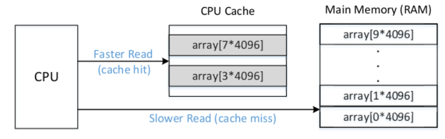
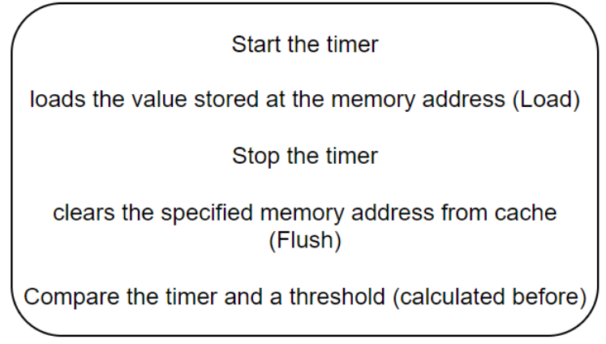

# Projet de Recherche en M1

Ce projet de recherche a été mené durant mon année de Master 1 (M1) avec une GRANDE collaboration de plusieurs collègues. J'ai choisi de respecter leur souhait de rester anonymes, mais en cas de besoin, je peux fournir les informations nécessaires sur leur contribution.


------------------------------------------------------------------------

1 - Introduction
============

The objective of this project was to reimplement the Gather Data
Sampling (GDS) attack, as introduced in the Downfall research paper, and
analyze its performance and limitations.

We will first talk about the prerequisites necessary to understand the
attack, namely an explanation of caches, the Flush+Reload attack and the
Specter vulnerability. We will then detail the GDS attack by explaining
its mechanism and the steps necessary for its execution. And finally, we
will talk about the results of the implementation, discussing the
successes and challenges encountered during the project.

The main sources of information for this project were three research
articles: Flush+Reload, Specter and Downfall. Additionally, there was a
presentation from Daniel Moghimi's Black Hat talk on Downfall.

2 - Necessary to understand GDS
===========================

2.1 What is a Cache?
----------------

A cache, is a small, fast memory in or next to the modern processor, it
contains parts of memory that have recently been accessed. We can see
below a processor which has 3 different levels of caches, the L1, L2
caches are small caches specific to each core, unlike L3 which is a
large cache common to all.


The caches are inclusive, this indicates that information in the L1 or
L2 cache will be in the L3 cache (this is not reciprocal obviously).

It is this inclusiveness that will be used in our attack.

The usefulness of the cache is to save time when repeatedly accessing
the same memory address. This is explained because during a first access
to a memory address (cache miss), the processor will have to fetch the
\"information\" from the RAM, which takes a long time, once retrieved,
it will fill the cache , which implies that the next time, it will find
the \"information\" directly in the cache (cache hit) and it will not
have to look for the information in RAM



2.2 Flush+Reload
------------

The first part of our research was to understand how Flush+Reload
worked. We therefore created our own attack scenario: a victim program
wants to execute a function located in a shared library, called *foo*.
Malware uses the Flush+Reload technique to spy on the victim and find
out if the function is called.

We have 3 files, victim.c which contains a victim program which uses
*foo* function located in a shared library bib.c and a spy in fr.c.

The idea is simple, when the victim wants to access the *foo* function,
the CPU will have to fetch the part of memory from RAM because it is not
yet in cache (cache miss) so it takes a lot of time. Conversely, during
the next accesses to the same part of memory (within a given time), the
CPU will find the information in the cache, which will save it a lot of
time. It is this difference in timing that we are about to exploit.



Here are the steps of our exploitation, first of all we launch a timer,
then we load the memory address that we want to monitor (whether the
victim accesses it or not), then we stop the timer, and we compare it to
a threshold.

This threshold is an average between a number $x$ of memory accesses
with a cache miss and a number $x$ of memory accesses with a cache hit,
this makes it possible to differentiate in which case we are, when we
compare ourselves to it.

Therefore if we are below this threshold, we know that the CPU quickly
finds the information so that it found it in the cache, which implies
that the information was already in the cache because of the victim and
that it used this part of memory.

On the other hand, if we are above this threshold, this implies that the
CPU has found the information in the RAM and therefore that the victim
has not used the part of memory in question.

Finally the flush instruction allows us to delete a part of memory from
the cache, this is essential, because when we check whether or not the
victim accesses the part of memory, we undeniably access it, which means
that we ourselves put this part of memory in cache, then we have to
flush after each check.


Here is the code of the attacker (the spy), the instruction *rdtsc* is
for the timer, *lfence* is to protect the order of instructions,
*mfence* is the same thing but about the memory, *clflush* is the flush
instruction and the other instructions are basics.

``` {.c}
int probe(char *adrs)
{
    volatile unsigned long time;

    asm __volatile__(
        "mfence \n" 
        "lfence \n" // to force sequential instructions
        "rdtsc \n"  // saving time 1st time
        "lfence \n"
        "movl %%eax, %%esi \n" // moving the measure in %esi
        "movl (%1), %%eax\n"   // we load adrs (which is in the cache or not)
        "lfence \n"
        "rdtsc \n"             // saving the time 2nd time
        "subl %%esi, %%eax \n" // 2nd time - 1st
        "clflush 0(%1) \n"     // flushing the entry
        : "=a"(time)
        : "c"(adrs)
        : "%esi", "%edx");


    printf("time : %ld\n", time);
    return time < THRESHOLD;
}
```

2.3 Spectre
-------

Spectre is an attack that exploits performance optimization used by
modern processors. CPU manufacturers, such as Intel, AMD, and ARM,
constantly strive to increase the performance of their processors. To
achieve this, they use methods like speculative execution and
out-of-order execution. Among these techniques, out-of-order execution
plays a role in certain variants of Spectre attacks.

To explain speculative execution simply, when a program asks for memory
access, the processor can guess what data will be needed next and start
getting and using that data before the request is officially processed.
If the guess is right and the anticipated data is indeed needed, the
program works well because the expected data is already there. But if
the guess is wrong, the speculatively fetched data is just ignored, and
the program goes back to an earlier state to follow the correct path.
This method helps the processor stay busy, which helps improve
performance.

Now, out-of-order execution is a performance optimization where the
processor does not strictly follow the order of instructions as they
appear in the program. Instead, it executes instructions as soon as
their input data and required resources are available. This means that
instructions later in the program can be executed before earlier ones if
their data dependencies are resolved, making better use of the CPU's
execution units and increasing performance. This technique allows the
processor to fully utilize its execution units and optimize performance,
but it can create windows where speculative instructions access
sensitive data, even if the execution of those instructions should be
later reverted.

Out-of-order execution is a fundamental technique exploited in Spectre
attacks. In this scenario, the processor speculates and executes
sensitive instructions while awaiting the resolution of memory reads.
Even if this speculation is later cancelled, the data loaded into the
cache remains accessible to the attacker.

``` {.c}
data1 = 0;
data2 = 0;
#Flush from the cache.
_mm_clflush(x);
#Time-consummong reading from memory
read_data_from_memory(x)
# Instruction independant of memory read
data1 = data1 + 5;
# Instruction dependant of memory read
data2 = x + data2;
```

In the context of this code example, if a memory read operation takes an
extended time, perhaps due to data eviction from the cache, the
processor may speculatively execute subsequent instructions during this
waiting period, preemptively anticipating the value of the memory to be
read. If the speculation is accurate, the program proceeds normally.
However, in the event of a failed memory read, the processor must roll
back all actions undertaken during speculation and revert to the
previous state, ensuring no residual effects.

While it's common practice to mitigate the effects of speculative
execution on registers and main memory to prevent speculative results
from altering the program's state, the challenge lies in addressing the
effects of speculation stored in the processor's cache. Unlike registers
and main memory, changes made to the cache are not easily undone,
creating a potential vulnerability. Attackers can exploit this by
employing techniques like 'flush and reload' to access speculative
results stored in the cache, even if the speculation is ultimately
cancelled. Consequently, sensitive data can be retrieved by attackers,
even if it's never actually utilized within the program.

2.4 Gather instruction
------------------

Gather instructions are a powerful feature in modern CPUs, introduced
with the AVX extensions. They enable efficient loading of data from
non-contiguous memory locations into a single vector register,
optimizing tasks that involve scattered data processing. While these
instructions enhance performance for specific computational tasks, they
also introduce vulnerabilities that can be exploited in attacks such as
Downfall.

These instructions are extensively used in domains that involve
processing large amounts of data efficiently. They significantly reduce
the overhead associated with traditional sequential access methods by
allowing multiple data elements from different memory locations to be
loaded simultaneously into a single vector register. This is useful for
applications requiring efficient data processing, such as cryptography,
databases, AI inference, and other fields involving large-scale data
manipulation. Gather instructions help achieve high performance by
minimizing memory access latencies and reducing the need for multiple
memory access instructions.

To understand how gather instructions work, let's consider an example
where they are used to load double-word (dword) data from memory into a
vector register. Here's a breakdown of the components involved:

-   MASK: A vector register that controls which elements should be
    loaded from memory and which should be ignored.

-   BASE: The base register containing the starting memory address for
    data loading.

-   INDEX: A vector register containing offsets relative to the base
    address for each element to be loaded.

-   1: Index scale, indicating that moves in the index register are
    multiplied by 1

-   RESULT: The destination vector register where the gathered data will
    be stored.

Consider the following gather instruction:

``` {.asm texcl="true"}
vpgatherdd 0(%r13, %zmm1, 1), %zmm5{%k1}
```

Here's a breakdown of this instruction:

-   0: Base offset, here it is 0.

-   %r13: Base register containing the starting memory address.

-   %zmm1: Index register containing offsets relative to the base
    address for each element to be loaded.

-   1: Scale factor, multiplying the values in %zmm1 by 1.

-   %zmm5: The destination register where the gathered data will be
    stored.

-   %k1: Mask register that controls which elements should be loaded
    from memory. A bit set to 1 in the mask register means the
    corresponding element will be loaded; a bit set to 0 means the
    element will be ignored, and the current value in the destination
    register will be retained.

For each element to be loaded, the memory address is calculated as
follows:

$$\text{Address} = \text{BASE} + (\text{INDEX} \times \text{SCALE}) + \text{OFFSET}$$

In this case, the address of each element is calculated by adding the
values of the base register (%r13) with the values of the index register
(%zmm1) multiplied by the scale (1), plus the offset ( 0).

3 - Gather data sampling
====================

Now comes the attack introduced in the paper, which is Gather Data
Sampling (GDS).

3.1 Gather instruction leaks
------------------------

To understand this attack, we must turn to the *gather* instruction
which, with no optimization whatsoever, is pretty slow. This comes from
the fact that gather fetch some scattered memory, and these fetch relies
on the disk which cannot really be sped up short of changing the disk
itself. To speed up the execution of that instruction, the engineers at
Intel thought of multiple optimization to improve the execution :

-   Only fetch the data at the indexes which has been masked through the
    masking vector

-   If the disk allows it, make multiple memory read in parallel

-   Store partial result of a gather execution and reuse it if needed

This last bullet point implies the use of a buffer to store the partial
execution. The vulnerability that GDS will exploit lies in this buffer
being shared across processes running on the same core. Moreover, these
buffers aren't wiped out between context switch of processes. The
consequences of that is that if we somehow may read what's in that
buffer, we can steal some data read by another process.

Here comes the heart of the attack : when executing the gather
instruction in speculative execution, the instruction will not do any
check and will output some part of the shared buffer. Let's exploit all
of that in detail.

Note that, while *gather* can leak some data from the shared buffer,
there is a long list of vectorial instructions that uses the buffer. So
any process that uses instructions from the following list can have some
data stolen


3.2 GDS in 4 steps
--------------

We'll now explain in detail how to use Gather Data Sampling and walk
through the 4 steps.

``` {.asm}
// Step (i): Increase the transient window
lea addresses_normal, %rdi
clflush (%rdi)
mov (%rdi), %rax
// Step (ii): Gather uncacheable memory
lea addresses_uncacheable, %r13             //set address
mov $0b1111111111111111, %rdi               //set mask
kmovq %rdi, %k1
vpxord %zmm1, %zmm1, %zmm1                  //set indexes
vmovups (%rsi), %zmm1
vpgatherdd 0(%r13, %zmm1, 1), %zmm5{%k1}    //gather
// Step (iii): Encode (transient) data to cache
movq %xmm5, %rax
encode_eax
// Step (iv): Scan the cache
scan_flush_reload
```

### Step (i) : Enter in speculative execution

First off, we must enter in speculative execution. There are multiple
ways to do so, but the easiest is to simply trigger a cache miss. Once a
cache miss occurs, The execution needs to go fetch some data in memory,
put it in the cache and then use the data. This takes some considerable
time and to increase the execution speed, the processor enter in
speculative execution mode while the cache miss is resolved.

In order to trigger the cache miss, we will flush some data from the
cache (in the figure GDS code), the data is at the address stored in *rdi*),
then load back the data that has just been flushed into a register (in
the figure GDS code, by doing a *mov* of the previous data into
*rax*).

Once that's done, we are executing in speculative execution and we are
ready to move on to step 2.

### Step (ii): Gather uncacheable memory

Now it is a matter of actually getting the data. In speculative
execution, if we use *gather* at an uncachable memory, say at address
*0x0*, we will be getting some of the data contained in the
afordescribed shared buffer.

In the figure GDS code, we setup our registers like so

-   Fill the register *k1* with 1s so that every indexes are masked and
    we gather as much data as possible

-   Fill the *zmm1* vectorial register with indexes found in the array
    at address stored in *rsi* (which is an argument passed). Since we
    gather double words (4 bytes), this array will contain indexes in
    {0, 4, 8, \...} and it will contain 8 indexes (considering
    *gatherdd* can only gather 8 double words)

-   Choose an uncacheable address at which we will gather and put it in
    *r13*. Any uncacheable address will do because, by the nature of
    being non cacheable and currently executing speculatively, the check
    to whether that address is valid will be bypassed. So here, we'll
    gather at *0x0*

By the end of the execution of *gather*, we'll have transient data in
*zmm5* corresponding to some entries in the shared buffer.

### Step (iii) & (iv): Encode transient data to cache & scan the cache

Now all that's left to do is write the data we've just recently
uncovered from the shared buffer and put it in the cache. We do this
before we're caught up by the resolution of the cache miss that will
eject us from speculative execution (with cause, since when we exit
speculative execution in our case, the registers will be reverted to
their original values and we'll lose the data gathered from the shared
buffer). Note that, when exiting speculative execution, the data in the
cache is not reverted (as it would take as much time if not more than
resolving a cache miss), henceforth the reson to store the data in the
cache.

Finally, all that's left is using the Flush+Reload technique in order to
read the data in the cache. Which we'll cover in the next section.

4 - Cache Encoding and Analysis
===========================

4.1 Cache Encoding
--------------

Once we have launched the *gather* instruction in speculative execution.
We have to deal with the result of the temporal shared buffer returned
of the destination AVX register (in our example, a *ymm* one). We are
still in speculative execution but we need now to get throught a
vectorial register to an encoded value in the cache.

Let's consider here that we want to encode 8 bytes of the *ymm*
register. We first need to extract the first 8 bytes like figure. To do so we
extract from *ymm* to *xmm* 16 bytes. Then from *xmm* to *rax* 8 bytes.
We use *vextracti128* to extract from *ymm* to *xmm* and *pextrq* for
the case of *xmm* to *rax*.

.png)

Now we have the data we want to encode in the *rax* register (always in
speculative). We need now to split the *rax* register. Each byte
(character) of *rax* will be sent into other general purpose register
like *rbx, rcx\...* (figure). The idea behind it is to use each of these bytes
as an index to a big *ORACLE* array.


The *ORACLE* array is created to encode the *rax* characters as index
and when the speculative execution is done, take back the control flow
after the segmentation fault (due to the incorrect memory in the
*gather* instruction executed speculatively), and use the Flush and
Reload technique to find out what was the character used as indexes.

We need to understand why the *ORACLE* needs to be that big and why we
multiply the characters by $4096$ when we use them as indexed by
considering $4096$ the size of a page in our system. To encode properly
a value in the cache we need to be sure that there will be no collision
between two different values. By collision I mean two different
characters will affect two different cache entries. We know that our
system use 4096 bytes sized pages (figure). We also know
that one cache entry concerns one page. With these affirmations we can
know see where we are going.


For one character that we want to dump, we will use an array of size
$4096 \times 256$. $256$ corresponds to all the value possible for a
character and $4096$ will be the constant multiplication to ensure that
we only use one entry cache for one index of the array.

Since we want to encode 8 characters, our *ORACLE* array will be of size
$4096 \times 256 \times 8$ (figure). Just before encoding the characters. We have to
make sure that the cache is flushed to only have the page corresponding
to the character (used as index) in the cache.

.png)

4.2 Cache analysis
--------------

Once all the speculative instructions are done and thus the segmentation
fault occured. We managed to take the control back by using the *signal*
function on the SEGFAULT signal and also used the *sys/setjmp.h* library
to save the context and jump back to it when the process segfault.

When we take back the control on the program in the code. We have to be
aware that everything we did in [4.1] is discarded because it was speculative and generated an
error. Everything\... except the cache (as we saw it the Spectre part).
Then all we have to do now is to analyse each part of the *ORACLE* array
of the conerned bytes by using Flush and Reload. With $i$ the possible
value of the character used as index, and $c$ the current character we
are trying to find:
$$\forall i \in [0,255], \forall c \in [0,7] \quad flushreload(\text{ORACLE} + i \times 4096 + c \times 256 \times 4096)$$

If the Flush and Reload pass, it means the character $i$ was encoded
speculatively before [4.1](#ce){reference-type="ref" reference="ce"} and
we recovered it.

``` {.c}
for (size_t c = 0; c < 8; c++) {
    bool fr_ok = true;
    for (size_t i = 0; i < 256; i++) {
        int mix_i = i;
        if (fr_ok && flush_reload((uint8_t*)&ORACLE + (mix_i + (c * 256))
        * 4096)) {
            indexes[c] = (mix_i + (c * 256)) % 256;
            fr_ok = false;
        }
    }
}
```

5 Our results
===========

Now that we have a better understanding on how the GDS works, we'll
briefly showcase our results.

First, we've remade the downfall attack by simply spying on a program
that was using one of the instructions that uses the shared buffer. We
were trying to read a string that was used by some of the vulnerable
instructions from another process that is running on the same core. We
can read, just like in the paper, about 8 bytes of contiguous data and
this on multiple part of the string. Moreover, the noise we were able to
read was also some information on other process. Some of them were ASCII
and we could read them (path, mysql, gnu\...).

Although this works really well, we cannot read all of the part of the
string. We've tinkered with the program to read 16 bytes at a time (each
of the 8 bytes are contiguous), and we've uncovered more of the string
but still, we cannot read the string in its entirety and even less
figure out which part of the string each 8 bytes belonged to.

Next, we thought we could uncover an AES key from our own implementation
of a program that would continuously encrypt and decrypt. We've done the
AES program and tried to use our attacker on it. We could read the two
parts of the key, but we also could read a lot of other data (let's call
it noise). The problem is that this noise comes much more or as
frequently than the parts of the keys, so we've no real way to
distinguish between the keys and the noise.

Note that in the POC, the researcher is able to uncover a key by using
openssl as its victim, but looking at the code, we've not much idea as
of why this works. It's also important to note that the POC's attacker
does not work on our implementation of AES.

One last bullet point is that we manage to run GDS if the victim and the
attacker are on the same CPU core, but this doesn't work if the programs
are on different cores. We think that there is one shared buffer per
core. However, the AES POC shows the attack on different cores and
somehow works and we do not really understand how our program are really
different.

# References

- **Yuval Yarom and Katrina Falkner**, *Flush+Reload*, Usenix, 2018.  
  [https://www.usenix.org/system/files/conference/usenixsecurity14/sec14-paper-yarom.pdf](https://www.usenix.org/system/files/conference/usenixsecurity14/sec14-paper-yarom.pdf)

- **Paul Kocher, Daniel Genkin, Daniel Gruss, Werner Haas, Mike Hamburg, Moritz Lipp, Stefan Mangard, Thomas Prescher, Michael Schwarz, Yuval Yarom**, *Spectre*, IEEE, 2018.  
  [https://ieeexplore.ieee.org/abstract/document/8835233](https://ieeexplore.ieee.org/abstract/document/8835233)

- **Daniel Moghimi**, *Downfall: Exploiting Speculative Data Gathering*, Usenix, 2023.  
  [https://www.usenix.org/conference/usenixsecurity23/presentation/moghimi](https://www.usenix.org/conference/usenixsecurity23/presentation/moghimi)

- **Daniel Moghimi**, *Single Instruction Multiple Data Leaks in Cutting-edge CPUs, AKA Downfall*, Blackhat, 2023.  
  [https://www.youtube.com/watch?v=JLHh_oViXl8&t=1049s](https://www.youtube.com/watch?v=JLHh_oViXl8&t=1049s)

